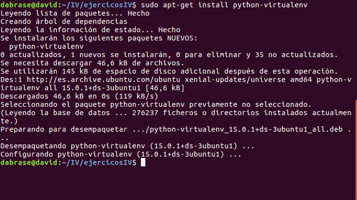
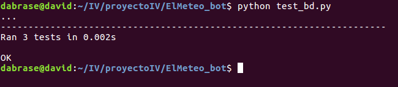

## David Brao Serrano

# Ejercicios Tema 2

## Ejercicio 1. Instalar alguno de los entornos virtuales de node.js (o de cualquier otro lenguaje con el que se esté familiarizado) y, con ellos, instalar la última versión existente, la versión minor más actual de la 4.x y lo mismo para la 0.11 o alguna impar (de desarrollo).

El lenguaje que se ha elegido ha sido **Python** y vamos a ver que tenemos todos los paquetes necesarios: `sudo apt-get install python-software-properties`

Ahora instalamos **virtualenv**: `sudo apt-get install python-virtualenv`



Creamos un virtualenv con: `virtualenv NombreProyecto`

## Ejercicio 2. Como ejercicio, algo ligeramente diferente: una web para calificar las empresas en las que hacen prácticas los alumnos. Las acciones serían: Crear empresa, Listar calificaciones para cada empresa, crear calificación y añadirla (comprobando que la persona no la haya añadido ya), borrar calificación (si se arrepiente o te denuncia la empresa o algo),    Hacer un ránking de empresas por calificación, por ejemplo, Crear un repositorio en GitHub para la librería y crear un pequeño programa que use algunas de sus funcionalidades. Si se quiere hacer con cualquier otra aplicación, también es válido. Se trata de hacer una aplicación simple que se pueda hacer rápidamente con un generador de aplicaciones como los que incluyen diferentes marcos MVC. Si cuesta mucho trabajo, simplemente prepara una aplicación que puedas usar más adelante en el resto de los ejercicios. 


## Ejercicio 3. Ejecutar el programa en diferentes versiones del lenguaje. ¿Funciona en todas ellas? 


## Ejercicio 4. Crear una descripción del módulo usando package.json. En caso de que se trate de otro lenguaje, usar el método correspondiente.


## Ejercicio 5. Automatizar con grunt, gulp u otra herramienta de gestión de tareas en Node la generación de documentación de la librería que se cree usando docco u otro sistema similar de generación de documentatión. . Previamente, por supuesto, habrá que documentar tal librería.

## Ejercicio 6. Para la aplicación que se está haciendo, escribir una serie de aserciones y probar que efectivamente no fallan. Añadir tests para una nueva funcionalidad, probar que falla y escribir el código para que no lo haga (vamos, lo que viene siendo TDD).

Para comprobar si hay ciudades

```
	total = funciones_bd.cuentaCiudades()
    self.assertNotEqual(total, 0)
```
Comprobar ciudad con una temperatura concreta

```
	ciudad_disponible = funciones_bd.ciudades("SELECT * FROM ciudades WHERE temperatura='10'")
	self.assertIsNotNone(ciudad_disponible)
```
Con los archivos ya creados, ejecutamos `python manage.py test`

## Ejercicio 7. Convertir los tests unitarios anteriores con assert a programas de test y ejecutarlos desde mocha, usando descripciones del test y del grupo de test de forma correcta. Si hasta ahora no has subido el código que has venido realizando a GitHub, es el momento de hacerlo, porque lo vas a necesitar un poco más adelante.

Archivo test_bd.py

```
import unittest
import funciones_bd

class TestStringMethods(unittest.TestCase):

    def test_existe_ciudades(self):
        """ Test que comprueba si hay ciudades disponibles. """
        total = funciones_bd.cuentaCiudades()
        self.assertNotEqual(total, 0)

    def test_nombre_ciudad(self):
        """ Test que devuelve true si hay una ciudad con una temperatura concreta. """
        ciudad_disponible = funciones_bd.ciudades("SELECT * FROM ciudades WHERE temperatura='10'")
        self.assertIsNotNone(ciudad_disponible)

    def test_temperatura_ciudad(self):
        """ Test que devuelve true si el nombre de la ciudad coincide"""
        nombre = funciones_bd.ciudades("SELECT ciudad FROM ciudades WHERE ciudad='granada'")
        self.assertEqual(nombre, "granada\n")

```
Para ver que funcionan los test: `python test_bd.py`



## Ejercicio 8. Haced los dos primeros pasos antes de pasar al tercero.

