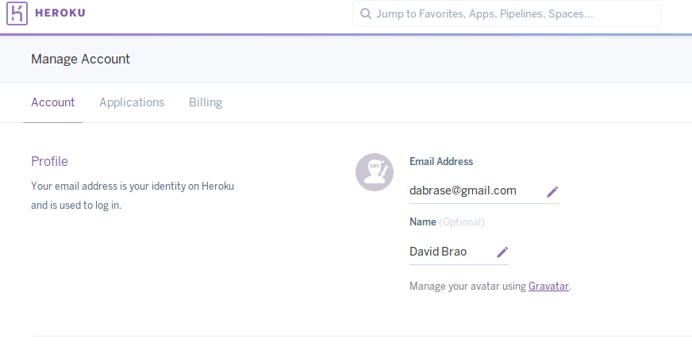

## David Brao Serrano

# Ejercicios Tema 3

## Ejercicio 1. Darse de alta en algún servicio PaaS tal como Heroku, Nodejitsu, BlueMix u OpenShift.

El servicio utilizado es [Heroku](https://dashboard.heroku.com)



## Ejercicio 2. Crear una aplicación en OpenShift o en algún otro PaaS en el que se haya dado uno de alta. Realizar un despliegue de prueba usando alguno de los ejemplos.

Cuando nos hayamos registrado en Heroku nos vamos a **New-->Create new app**


## Ejercicio 3. Realizar una app en express (o el lenguaje y marco elegido) que incluya variables como en el caso anterior.

La app creada es en Python ya que es un bot para telegram. He seguido este [Tutorial](http://bytelix.com/guias/crear-propio-bot-telegram/)

```
# Método que imprimirá por pantalla la información que reciba
def listener(bot, update):
    id = update.message.chat_id
    mensaje = update.message.text

    print("ID: " + str(id) + " MENSAJE: " + mensaje)


def mensaje_busqueda(mensaje):
    mensaje = ''.join(mensaje.split())
    ciudad=mensaje[0:3]
    return {'ciudad':ciudad }


# Método que utilizaremos para cuando se mande el comando de "start"
@bot.message_handler(commands=['start','hola'])
def start(message):
    bot.reply_to(message, "Bienvenido a tu bot de metereologia!!")
    
@bot.message_handler(commands=['tiempo'])
def tiempo_ciudad(m):
    """Función que envia la prediccion de la ciudad al usuario. """
    iconos = { '01d': "\xE2\x98\x80", '02d': "\xE2\x9B\x85", '03d':"\xE2\x98\x81",
    '04d': "\xE2\x98\x81",'09d':"\xE2\x98\x94" ,'10d':"\xE2\x98\x94" ,'11d': "\xE2\x9A\xA1" ,'13d': "\xE2\x9D\x84" ,'50d': "\xF0\x9F\x8C\x81" }
    
    message_id = m.message_id
    date = m.date
    text = m.text
    chat = m.chat
    chat_id = m.chat.id
    
    cid = m.chat.id # Obtenemos la id del usuario.
    mensaje = m.text[7:]
    resp = get_weather(mensaje)
    bot.send_message(cid, "Buscando el tiempo en "+ mensaje)
    if resp:
        icono = iconos.get(resp.icono,"\xE2\x98\x80")
        text = ("Actualmente: {} \n{}\nTemperature: {} ºC\nHumedad: {}%\nPresión: {} hPa").format(
                icono,resp.desc, resp.temp, resp.humedad, resp.presion)
        bot.send_message(chat_id, text, message_id)
    else:
        bot.send_message(chat_id, 'No puedo encontrar información meteorológica para esa ubicación.', message_id)
    return
    


bot.polling(none_stop=True)  
while True: #Infinite loop 
pass
```


## Ejercicio 4. Crear pruebas para las diferentes rutas de la aplicación.


## Ejercicio 5. Instalar y echar a andar tu primera aplicación en Heroku.

### Configuración

En primer lugar nos descargamos la linea de comandos de Heroku utilizando la orden 

```
wget -O- https://toolbelt.heroku.com/install-ubuntu.sh | sh

```

Para autentificarnos utilizamos `heroku login` y nos pedirá que introduzcamos **Email** y **Contraseña**

![Imagen 1] (http://i65.tinypic.com/2wdya6u.png)

### Implementar aplicación

Para crear una aplicación en Heroku: 

```

 heroku apps:create --region eu NOMBRE_APP

```
Ahora ejecutamos `git push heroku master`

La aplicación esta desplegada y lo sincronizaremos con Travis-CI y GitHub. Entramos a la configuración de nuestra aplicación en Heroku.

![Imagen 2] (http://i65.tinypic.com/2wc4g14.png)

## Ejercicio 6. Usar como base la aplicación de ejemplo de heroku y combinarla con la aplicación en node que se ha creado anteriormente. Probarla de forma local con foreman. Al final de cada modificación, los tests tendrán que funcionar correctamente; cuando se pasen los tests, se puede volver a desplegar en heroku.

## Ejercicio 7. Haz alguna modificación a tu aplicación en node.js para Heroku, sin olvidar añadir los tests para la nueva funcionalidad, y configura el despliegue automático a Heroku usando Snap CI o alguno de los otros servicios, como Codeship, mencionados en StackOverflow

## Ejercicio 8. Preparar la aplicación con la que se ha venido trabajando hasta este momento para ejecutarse en un PaaS, el que se haya elegido. 
