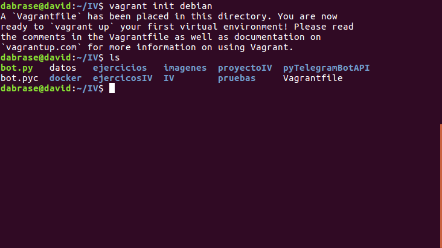

## David Brao Serrano

# Ejercicios Tema 6

## Ejercicio 1. Instalar chef en la máquina virtual que vayamos a usar

Instalamos Chef desde la pagina web:

``
curl -L https://www.opscode.com/chef/install.sh | bash
``


Comprobar que se ha instalado:

```
chef-solo -v

```

## Ejercicio 2. Crear una receta para instalar la aplicación que se viene creando en la asignatura en alguna máquina virtual o servidor en la nube.


## Ejercicio 3. Desplegar la aplicación de DAI con todos los módulos necesarios usando un playbook de Ansible.


## Ejercicio 4. Instalar una máquina virtual Debian usando Vagrant y conectar con ella.

Para instalar Vagrant ejecutamos `sudo apt-get install vagrant`


Instalamos la versión Debian ejecutando `vagrant box add debian http://static.gender-api.com/debian-8-jessie-rc2-x64-slim.box`


Ejecutamos ahora `vagrant init debian` para crear el fichero vagrantfile



## Ejercicio 5. Crear un script para provisionar `nginx` o cualquier otro servidor web que pueda ser útil para alguna otra práctica

He creado un fichero nginx.sh que tiene lo siguiente:

```
#!/bin/bash
sudo apt-get update && apt-get install -y nginx
sudo service nginx restart && sudo service nginx status
```
Se ha creado el fichero **Vagrantfile**:

```
# -*- mode: ruby -*-
# vi: set ft=ruby :

Vagrant.configure(2) do |config|
  config.vm.box = "debian"

  config.vm.provision "shell",
    path: "nginx.sh"
end
```

## Ejercicio 6. Configurar tu máquina virtual usando vagrant con el provisionador chef.


